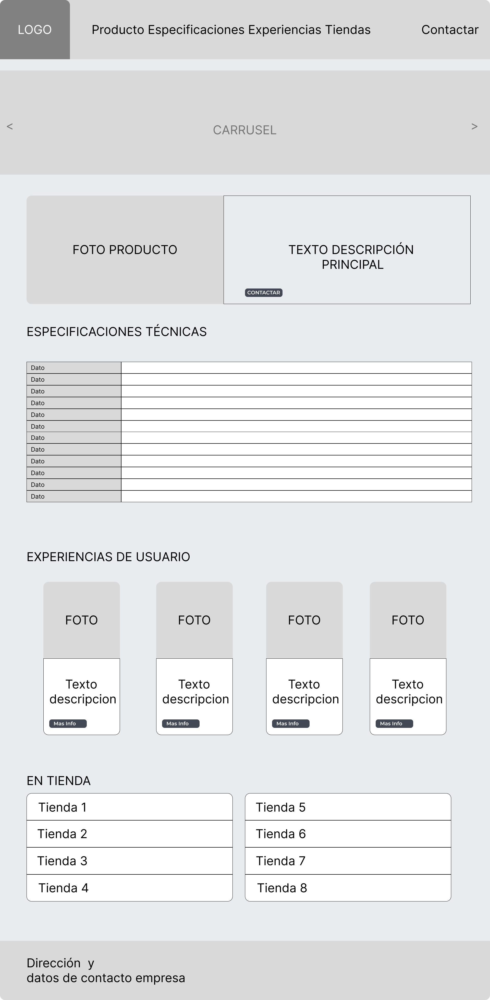

# 💕 Rhymance - Donde la Poesía Encuentra el Amor


🔗 **[Ver Demo en Vivo](https://rhymance.netlify.app/)**

> **Proyecto Final del Curso de Bootstrap de Mastermind.ac**

<p align="center">
  
</p>

## 📖 Descripción

**Rhymance** es una aplicación de citas revolucionaria que conecta personas a través de la poesía en lugar de fotos. En Rhymance, los usuarios descubren conexiones basadas en la sensibilidad literaria, deslizando versos en lugar de imágenes.

Este proyecto es una landing page completa que presenta el producto y permite a los usuarios contactar con el fabricante.

La descripción para cumplir con el reto final del curso de Bootstrap es la siguiente:

```md
Llegamos al Reto Final y queremos practicar el mayor número de componentes y utilidades de Bootstrap. Para sigue las siguientes instrucciones:

Web de presentación y venta de un producto recién lanzado al mercado

- Página principal de producto
- Página de contacto con fabricante

 ---

  Antes de comenzar  

Define un template de colores **nuevo**  que se usará en el proyecto aplicando la customización con Sass. En este nuevo template de colores crea dos esquemas de colores: uno oscuro y un claro. Hazlo tanto para el color del fondo como para el color del texto.

**Página principal de producto:**

- Menú de navegación fijo en parte superior, con Logo en formato imagen. Enlaces a las partes de la página, incluyendo scrollSpy.
- Carousel con al menos dos fotos.
- Tarjeta con foto y descripción del producto. El botón “Contactar” llevará a la misma página que la del menú de navegación. A la foto principal del producto se le añade un Modal que cuando se haga click se abra la imagen del producto en grande.
- Apartado de especificaciones técnicas con una tabla de al menos 5 filas.
- Apartado de Experiencia de usuarios usando GRID y tarjetas con al menos una foto y un botón de Mas Info que lanzará un PopOver con los datos del cliente, el país de uso y cuanto tiempo lleva usandolo.
- Apartado En Tienda donde se usará un List Group, y en cada elemento aparecerá el nombre de la tienda, el país, población y otros datos de contacto.
- **Footer** final con los datos del fabricante

**Ejemplo de diseño:**



Página contacto de fabricante:

En este caso implementaremos un formulario de contacto pidiendo más información al fabricante. El formulario debe contener la siguiente información:

- Nombre del cliente
- País
- Ciudad
- Correo electrónico
- Selección del modelo de producto sobre el que se pregunta (en este caso se creará un seleccionable con al menos 4 modelos)
- Check pidiendo si la persona es particular o empresa
- Text Área con el texto que se utiliza
- Botón de solicitud

---

Si quieres desarrollar un proyecto personal, y quieres feedback u orientación sobre el, en el momento de la entrega debes explicarnos todos los componentes utilizados, y el mockup.
```

## ✨ Características del Proyecto

### 🎨 Personalización con Sass

- **Paleta de colores personalizada** definida con variables Sass
- **Tema oscuro y claro** implementados mediante esquemas de color
- Colores principales:
  - `$rhymancedark: #8B1E2D` - Rojo vino elegante
  - `$rhymancelight: #F1A1A7` - Rosa suave
  - `$passion-text: #E63946` - Rojo pasión
  - `$liryc-text: #6A4C93` - Púrpura lírico

### 📄 Páginas Incluidas

| Página | Descripción |
| -------- | ------------- |
| `index.html` | Página principal del producto |
| `contact.html` | Formulario de contacto con el fabricante |
| `privacy.html` | Política de privacidad |
| `terms.html` | Términos y condiciones |
| `cookies.html` | Política de cookies |

---

## 🧩 Componentes Bootstrap Utilizados

### Página Principal (`index.html`)

| Componente | Uso en el Proyecto |
| ------------ | ------------------- |
| **Navbar** | Menú de navegación fijo en la parte superior con logo en formato imagen |
| **ScrollSpy** | Navegación que resalta la sección activa al hacer scroll |
| **Carousel** | Slider con 2 imágenes promocionales y textos descriptivos |
| **Cards** | Tarjetas para la demo interactiva del producto y testimonios |
| **Modal** | Ventanas emergentes para ver perfiles de usuarios (Álex y Limary) |
| **Table** | Tabla de especificaciones técnicas con 6 características |
| **Grid System** | Layout responsive para la sección de experiencias |
| **Popover** | Información adicional en los botones "Más info" de testimonios |
| **List Group** | Enlaces de descarga (App Store, Google Play, Web App) |
| **Badges** | Etiquetas de estado (Premium, Incluido, Beta) |
| **Footer** | Pie de página con información del fabricante y enlaces |

### Página de Contacto (`contact.html`)

| Componente | Uso en el Proyecto |
| ----------- | ------------------- |
| **Form Controls** | Inputs para nombre, país, ciudad y email |
| **Select** | Selección del modelo de producto (4 opciones) |
| **Radio Buttons** | Tipo de cliente (Particular/Empresa) |
| **Textarea** | Campo de texto para el mensaje |
| **Button** | Botón de envío del formulario |
| **Form Validation** | Validación de campos requeridos |

---

## 🎯 Demo Interactiva

El proyecto incluye una **demo interactiva estilo Tinder** que simula la experiencia de la app hecho con Bootstrap y JavaScript puro:

- Interfaz de iPhone con diseño realista
- Tarjetas de poemas deslizables
- Botones de acción (Like, Nope, etc.)
- Animaciones suaves con CSS

---

## 🛠️ Tecnologías Utilizadas

- **Bootstrap 5.3.8** - Framework CSS
- **Sass** - Preprocesador CSS para customización
- **Webpack 5.94** - Bundler y servidor de desarrollo
- **Babel** - Transpilador JavaScript
- **Bootstrap Icons** - Iconografía

---

## 📦 Instalación

```bash
# Clonar el repositorio
git clone https://github.com/luismarrer/rhymance.git

# Entrar al directorio
cd rhymance

# Instalar dependencias
npm install
```

## 🚀 Scripts Disponibles

```bash
# Servidor de desarrollo con hot reload
npm run dev

# Compilar para producción
npm run build

# Modo watch para desarrollo
npm run watch
```

## 📁 Estructura del Proyecto

```plaintext
rhymance/
├── index.html          # Página principal
├── contact.html        # Página de contacto
├── privacy.html        # Política de privacidad
├── terms.html          # Términos y condiciones
├── cookies.html        # Política de cookies
├── package.json        # Dependencias del proyecto
├── webpack.config.js   # Configuración de Webpack
├── css/
│   ├── styles.css      # Estilos principales
│   ├── swipe.css       # Estilos de la demo interactiva
│   └── custom.min.css  # CSS compilado
├── scss/
│   └── custom.scss     # Personalización Bootstrap con Sass
├── js/
│   ├── main.js         # JavaScript principal
│   └── swipe.js        # Funcionalidad de swipe
├── images/
│   ├── logo.png        # Logo de Rhymance
│   ├── poems/          # Imágenes de poemas
│   ├── icons/          # Iconos
│   └── favicon_io/     # Favicons
└── mockup/             # Recursos de diseño
```

## 🎨 Personalización de Temas

El proyecto implementa **dos esquemas de color** mediante Sass:

```scss
// Tema Claro
$light-background: #F8F9FA;
$light-text: #212529;

// Tema Oscuro (por defecto)
$dark-background: #181112;
$dark-text: #EAEAEA;
```

Para cambiar entre temas, modificar la variable `$theme` en `scss/custom.scss`:

```scss
$theme: dark !default;  // Cambiar a 'light' para tema claro
```

## 👨‍💻 Autor

Yo, **Luis Marrero** :)

- 🌐 [Portfolio](https://luismarrer.github.io/en/)
- 💼 [LinkedIn](https://www.linkedin.com/in/luismarrer/)
- 🐦 [Twitter/X](https://x.com/luismarrer_dev)

Este proyecto fue creado como **proyecto final del curso de Bootstrap**.
