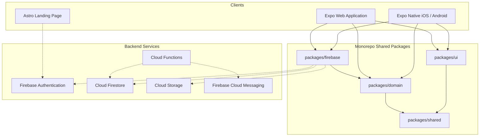

# Architecture Overview

This document provides a high-level overview of the Rhymance architecture.

---

## 1. System Topology

Rhymance is composed of client-side web and mobile apps, shared utility and domain packages, and a Backend-as-a-Service layer managed by Firebase.



---

## 2. Monorepo Package Directory Structure

To keep code clean and maintain separation of concerns, the project enforces a unidirectional dependency rule. Lower packages must never depend on higher packages.

| Package | Purpose | Dependencies |
|---------|---------|--------------|
| `apps/marketing` | Astro marketing and landing page. Contains only promotional code and static demo files. | None |
| `apps/app` | Main React Native product. Coordinates views, routing, and invokes repository injections. | `packages/domain`, `packages/firebase`, `packages/ui` |
| `packages/firebase` | Firebase client SDK bindings, collection configurations, and Repository implementations. | `packages/domain`, `packages/shared` |
| `packages/ui` | Reusable cross-platform design components (buttons, layout containers, forms). | `packages/shared` |
| `packages/domain` | Business entity models (User, Poem, Match), schema validators, and repository interfaces. | `packages/shared` |
| `packages/shared` | Core constants, basic type definitions, standard logger, and date helpers. | None |

---

## 3. Decoupling Persistence: Repository Pattern

To protect the application codebase from direct dependency on the Firebase SDK APIs (avoiding vendor lock-in), we enforce the Repository Pattern. All persistence and auth operations in `apps/app` must interact with interfaces defined in `packages/domain`.

### Flow Example: Fetching Discovery Poems

1. **Interface Definition** (`packages/domain/src/repositories/PoemRepository.ts`):
   ```typescript
   export interface PoemRepository {
     getDiscoveryPoems(filters: DiscoveryFilters, limit: number): Promise<Poem[]>;
   }
   ```

2. **Concrete Implementation** (`packages/firebase/src/repositories/FirestorePoemRepository.ts`):
   ```typescript
   import { collection, query, where, limit, getDocs } from 'firebase/firestore';
   import { PoemRepository, Poem, DiscoveryFilters } from '@rhymance/domain';
   import { db } from '../config';

   export class FirestorePoemRepository implements PoemRepository {
     async getDiscoveryPoems(filters: DiscoveryFilters, limitCount: number): Promise<Poem[]> {
       const poemsRef = collection(db, 'poems');
       const q = query(
         poemsRef,
         where('moderationStatus', '==', 'approved'),
         where('language', '==', filters.language),
         limit(limitCount)
       );
       const snapshot = await getDocs(q);
       return snapshot.docs.map(doc => ({ id: doc.id, ...doc.data() } as Poem));
     }
   }
   ```

3. **Dependency Injection & Usage** (`apps/app/src/screens/DiscoveryScreen.tsx`):
   ```typescript
   import React, { useEffect, useState } from 'react';
   import { Poem } from '@rhymance/domain';
   // Injected via a Context provider or DI container:
   import { useRepositories } from '../context/RepositoryContext';

   export const DiscoveryScreen = () => {
     const { poemRepository } = useRepositories();
     const [poems, setPoems] = useState<Poem[]>([]);

     useEffect(() => {
       poemRepository.getDiscoveryPoems({ language: 'es' }, 10)
         .then(setPoems)
         .catch(console.error);
     }, [poemRepository]);

     // Render swiping layout...
   };
   ```

---

## 4. State Management Strategy

1. **Authentication Session State**: Managed globally via a React Context provider (`AuthContext`). It listens to Firebase Auth changes in the background (`onAuthStateChanged`) and updates user profile data retrieved from Firestore.
2. **Local Recruiter Demo Sandbox State**: When the app operates in Demo Mode, a Mock Context swaps concrete Firebase Repository classes with local memory implementations (`MockUserRepository`, `MockPoemRepository`) that use React state and `AsyncStorage` to persist swipes and matches.
